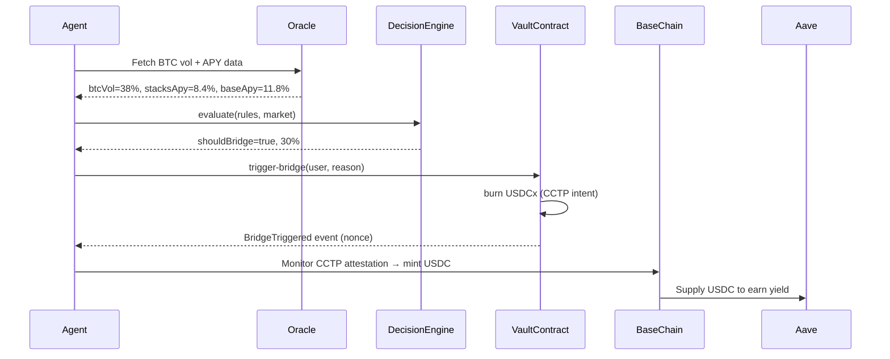

# Bitflow 🔶

**Bitcoin-Native Yield Optimization · Powered by CCTP · Built on Stacks**

Bitflow is an autonomous DeFi protocol that lets users deposit USDCx into a Clarity vault on Stacks, configure an AI agent personality, and automatically bridge funds to Base/Aave via CCTP when yields favor it — all while staying Bitcoin-aligned.

---

## 🏗 Architecture

```
Bitflow/
├── contracts/            # Clarity smart contracts (Stacks blockchain)
│   ├── contracts/
│   │   ├── sip010-trait.clar   # Standard SIP-010 FT interface
│   │   ├── usdc-token.clar     # Mock USDCx token (testnet)
│   │   └── vault.clar          # Core vault: deposit/withdraw/bridge
│   ├── tests/
│   │   └── vault_test.ts       # Clarinet unit tests (8 tests)
│   └── Clarinet.toml
│
├── agent-service/        # Node.js off-chain agent backend
│   └── src/
│       ├── oracle.ts     # Pyth BTC price + volatility + Zest/Aave APY
│       ├── decision.ts   # Decision engine (Safe/Balanced/Chaser logic)
│       ├── executor.ts   # Stacks.js bridge tx broadcaster
│       ├── leaderboard.ts # SQLite performance tracking
│       ├── server.ts     # Express REST API
│       └── cron.ts       # Hourly agent loop
│
└── frontend/             # Next.js 14 + Tailwind dark UI
    └── app/
        ├── page.tsx            # Landing page (live stats, how it works)
        ├── dashboard/page.tsx  # Vault positions, charts, deposit modal
        ├── agent/page.tsx      # Agent personality picker + sliders
        └── leaderboard/page.tsx # Ranked agent performance table
```

---

## 🚀 Quick Start

### 1. Smart Contracts

```bash
# Install Clarinet (Stacks dev tool)
brew install clarinet

cd contracts
clarinet check        # Syntax check all contracts
clarinet test         # Run 8 unit tests
clarinet console      # Interactive REPL
```

**Deploy to testnet:**
```bash
clarinet deployments generate --testnet
clarinet deployments apply -p deployments/default.testnet-plan.yaml
```

### 2. Agent Service

```bash
cd agent-service
npm install
cp .env.example .env      # Fill in contract addresses after deploy

# Development (auto-restart on changes)
npm run dev               # Starts Express API on :3001

# Run agent cron loop
npm run agent             # Hourly decision + bridge loop
```

**Available API endpoints:**

| Method | Path | Description |
|--------|------|-------------|
| GET | `/api/market` | Live BTC price, volatility, Stacks APY, Base Aave APY |
| GET | `/api/decision/:type` | Dry-run decision for `safe`/`balanced`/`chaser` |
| POST | `/api/decision` | Custom rules decision |
| GET | `/api/leaderboard` | Top 10 agents by net yield |
| POST | `/api/execute` | Trigger bridge if conditions met |
| POST | `/api/snapshot` | Update agent performance record |

### 3. Frontend

```bash
cd frontend
npm install
npm run dev               # Starts Next.js on :3000
```

Open [http://localhost:3000](http://localhost:3000)

---

## 🎯 Agent Personalities

| Agent | Bridge | Max Vol | Min APY on Stacks | Strategy |
|-------|--------|---------|-------------------|----------|
| 🛡️ Safe Maximalist | 20% | <20% | 10% | Bitcoin-aligned, minimal bridging |
| ⚖️ Balanced | 30% | <40% | 8% | Auto-rebalance when yield spread > 3% |
| 🚀 Yield Chaser | 50% | Any | 5% | Aggressive cross-chain yield hunt |

---

## 🌉 Bridge Flow (CCTP / xReserve)



1. Off-chain agent fetches market data every hour
2. Decision engine evaluates user's rules vs current conditions
3. If conditions met → calls `trigger-bridge` on Clarity vault
4. Vault burns USDCx (emitting CCTP burn intent via xReserve)
5. CCTP attestation → USDC minted on Base → auto-supplied to Aave
6. Yield tracked → leaderboard updated

---

## 📊 Leaderboard

Users who opt-in share anonymized performance data:

- **Net yield %** since agent activation
- **Number of bridges** executed
- **Agent type** (Safe / Balanced / Chaser)
- **TVL** (total value locked in vault)

Refreshes every 30 seconds in the UI.

---

## 🔐 Security Notes

- Vault enforces max bridge of 50% per trigger (hardcoded in contract)
- Only approved off-chain agents can call `trigger-bridge`
- Users can disable auto-execute (suggest-only mode)
- Clarity immutability ensures rules can't be changed mid-execution

---

## 🧪 Testing

```bash
# Clarity unit tests (requires Clarinet)
cd contracts && clarinet test

# API manual test
curl http://localhost:3001/api/market
curl http://localhost:3001/api/decision/balanced
curl http://localhost:3001/api/leaderboard
```

---

## 📦 Tech Stack

| Layer | Technology |
|-------|-----------|
| Smart Contracts | Clarity (Stacks) |
| Bridge | CCTP / xReserve (Circle) |
| Price Oracle | Pyth Network |
| Yield Data | Zest Protocol + Aave v3 Subgraph |
| Agent Backend | Node.js + TypeScript + Express |
| Database | SQLite (better-sqlite3) |
| Frontend | Next.js 14 + Tailwind CSS |
| Charts | Recharts |
| Wallet | Hiro / Leather (@stacks/connect) |

---

## 🏆 Hackathon

Built for DoraHacks · Stacks Hackathon 2026

Bounties targeted:
- ✅ **Programmatic Bridge** — CCTP/xReserve integration in Clarity vault
- ✅ **Bitcoin-Native Logic** — BTC volatility as bridge gating signal
- ✅ **AI/Agent Trend** — Autonomous yield agent with personality customization
- ✅ **Measurable Results** — Public performance leaderboard
